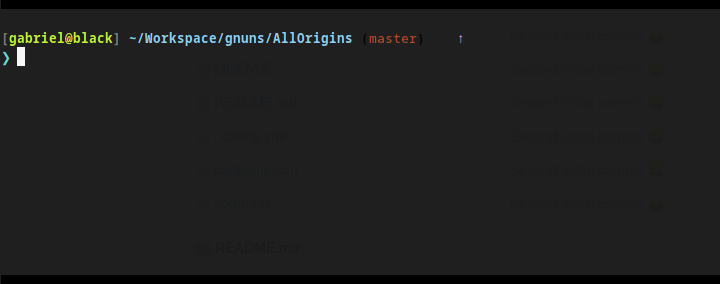

## :newspaper: vpdate

[](https://www.npmjs.com/package/vpdate)

a simple CLI to keep your package.json version updated

#### install
```sh
npm i -D vpdate
```


#### demo



#### use
* add the script
```js
// package.json
// [...]
    "scripts": {
        "push": "vpdate && git push"
    }
// [...]
```

* and have fun

```sh
npm run push
```